# AI Scientist: Autonomous Research Agent

## Initial inspiration

Often people talk about a future where AI (autonomously) contributes to scientific research. Keeping this ideal in the back of my mind, I was curious to see how far I can go today with AI autonomously doing science when the following situation emerged: listening to the Aella interview by Lex Friedman where she was saying she has so much unanalyzed survey data and around that same time I was starting to use and see great benefit in using Codex CLI in my other works.

## High-level
The system is a python script runs in a loop enforcing some guardrails with the agents.md containing the guidance/plan.

Dataset: [childhoodbalancedpublic](https://knowingless.com/raw-data/#:~:text=Childhood%20Experiences%20Raw%20Data%20(cleaned%20and%20somewhat%20population%2Dweighted%20data)) 15k respondents from Aella's survey

Model: gpt-5-codex-high via Codex CLI

## Architecture

The system follows a stage-locked research pipeline:

```mermaid
flowchart TD
    Start["🔄 Bootstrap"]
    Lit["📚 Literature<br/>(collect sources)"]
    PAP["📋 PAP<br/>(freeze plan)"]
    Ana["🔬 Analysis<br/>(run tests)"]
    Sens["⚖️ Sensitivity<br/>(robustness)"]
    Writ["✍️ Writing<br/>(manuscript)"]
    Rev["👀 Review<br/>(critic pass)"]
    Rel["🚀 Release"]
    
    Start -->|bootstrap_complete| Lit
    
    Lit -->|"✓ ≥3 DOIs<br/>✓ Bib parses<br/>✓ Evidence map"| PAP
    
    PAP -->|"✓ PAP frozen<br/>✓ registry_url<br/>✓ Measures valid"| Ana
    
    Ana -->|"✓ Estimands done<br/>✓ Falsification check"| Sens
    
    Sens -->|"✓ Design-effect<br/>synthesis<br/>✓ Default spec"| Writ
    
    Writ -->|"✓ Outline done<br/>✓ STROBE/SAMPL<br/>✓ LaTeX PASS"| Rev
    
    Rev -->|"✓ CONTINUE<br/>✓ DAG + ID<br/>✓ Disclosure<br/>✓ Claim coverage"| Rel
    
    Rel --> End["✅ Complete"]
    
    style Start fill:#e8f5e9
    style Lit fill:#e3f2fd
    style PAP fill:#fff3e0
    style Ana fill:#f3e5f5
    style Sens fill:#fce4ec
    style Writ fill:#f1f8e9
    style Rev fill:#ffebee
    style Rel fill:#c8e6c9
    style End fill:#81c784
```

## Experiments & Learnings

My personal requirement was a system with as much autonomy for the AI agent as possible. However, seeing how the agent behaved during experiments, I added extra guardrails that I touch upon below.

### Experiment 1: Too Many Hypotheses

In the first experiment, the agent generated so many hypotheses that it lost track of what it was working on. Therefore I instructed it to have a limited number of hypotheses as well as stage locking. 

### Experiment 2: Stage Locking

While the agent was instructed to walk the different stages of the scientific process (literature review, pre-approved plan, etc), it seemed to be intermingling these steps. Therefore I introduced locked-stages, e.g., the agent can only advance to the next phase when the current phase is fully finished. While beneficial for the focused work, it did cause an issue when the agent got 'stuck' at a stage.

### Experiment 4b: The Literature Review Saga 

Stage locking caused the AI agent to get stuck in experiment 4b during the literature review process.

In experiment 1, I just let the agent use internet search for literature review. It didn't find many relevant articles.
After seeing [Sakana](https://sakana.ai/ai-scientist/) (another AI scientist implementation) use Semantic Scholar (a semantic search engine for academic literature), I suggested in experiment 2 the agent uses Semantic Scholar for literature review. While finding some articles, it didn't find articles for each hypothesis. 
That's why in experiment 4b, I explicitly instructed it to find at least 1 article per hypothesis via Semantic Scholar. Now it faced a transient API error which led it to draft a support ticket to Semantic Scholar ([`semantic_scholar_support_ticket_draft_2025-11-10.md`](./experiment_4b_aella_extensive_direct_edits_not_json/lit/semantic_scholar_support_ticket_draft_2025-11-10.md)). Finally, the agent came up with using CrossRef to finalize its literature review.

## What could be better?

The architecture has a Science Loop and a Review Loop:
- **Science Loop**: does the actual research
- **Review Loop**: a reviewer agent that can only make notes in a single file (can't edit the research directly)
- The next Science Loop uses previous reviews as input

I originated this structure to keep the AI's quality high and aligned through the process, but realized it's highly inefficient. The science loop spends 1/3 of its tokens on reading context and previous work, then 1/3 on actually doing stuff and then 1/3 on reviewing itself and finishing up. With the review agent not doing any 'tangible' work, this means only 1/6 of the agent's time is actually spent on forward progress toward the end goal. This is both expensive (tokens) and slow (wallclock time).

### Reproducibility vs. Scientific Rigor

Reproducibility by itself is important to science and especially now, with a human reviewing retroactively instead of doing the work straight away. It seems like the AI agent took reproducibility too literally and in the midst of this lost sight of scientific standards in favor of reproducibility theatre. While you could try to fix this within the 'prompt' aka agents.md, I bet most value could come from a fine-tuned model. The science agent's job seems too diverted from what it was initially trained to do. (Note: [FutureHouse/Edison](https://www.futurehouse.org/research-announcements/ether0-a-scientific-reasoning-model-for-chemistry) is taking this direction, having fine-tuned a Mistral model on specific scientific workflows.) The paper generated through experiment 4b is (far) below scientific standards (see the notes gpt-5-pro made in [`manuscript_4b_annotated.pdf`](./manuscript_4b_annotated.pdf)) 

## Meta: is this just a "scientific slop" machine? 

Typically impact is measured in science by citations. In an efficient world, a paper gets read and influences discourse to the extent it deserves. But I don't think even the world of science operates efficiently e.g., just putting a(n AI-generated) paper online won't be enough for it to be fairly evaluated. What's more is that there seems to be an asymmetry between the types of science:

- **Hard science results speak for themselves**: If an AI runs 1,000 experiments and one discovers penicillin, the benefits are self-evident. Everyone becomes an advocate for it naturally.

- **Social science results need an instigator**: A human has to "sell" the importance of a finding for it to propagate through the discourse.

Maybe one day AI will be the algorithm by which papers get distributed and evaluated, getting us closer to a perfectly efficient market of scientific information.

For "AI scientists doing autonomous research" to truly advance, we need pipes: infrastructure where AI can not only design experiments but also physically run them (like robotic biology labs).

## Open idea

Especially with a fine-tuned model, today's AI has enough raw intelligence to analyse digital-only scientific data. This can be used for the following: compute embeddings on the entire scientific literature so that you have a granular map of each scientific topic with corresponding papers. Then you can have the AI contrast and compare results within them, consider reproducibility and potentially undervalued ideas.

## Experiment Variants

- **experiment_1**: Initial run
- **experiment_2a**: Minimal protocol with external prompts in `agents.md`
- **experiment_2b**: Full science protocol with comprehensive deliverables
- **experiment_3a**: Minimal version of stage locking, explicit review agent and explicit semantic scholar
- **experiment_3b**: Stage locking, explicit review agent and explicit semantic scholar
- **experiment_4a**: Direct file edits (no JSON), minimal scaffold
- **experiment_4b**: Direct file edits,  *(only one run to completion)*
- **experiment_5a**: gpt-5-high instead of gpt-5-codex-high
- **experiment_5b**: AI choosing which model is used in the next loop
