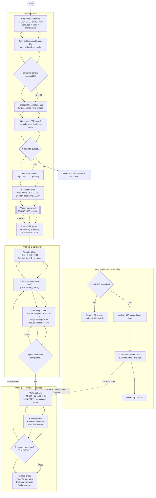

```mermaid
flowchart TD
    %% High-level phases and key decisions from decision_log.csv
    A0([Start]) --> A1[Bootstrap scaffolding<br/>'ts 2025-11-07 14:21-14:29'<br/>state.json + stubs + manuscripts]
    A1 --> A2[Tooling: Semantic Scholar CLI<br/>'rate-limit headers, env key']
    A2 --> D1{Semantic Scholar accessible?}

    D1 -- "No (403)" --> A3[Fallback: CrossRef queries<br/>Evidence map + bib synced]
    A3 --> A4[Gate: keep PAP in draft<br/>repro checks + disclosure guard]
    A4 --> D2{Sustained outage?}
    D2 -- "Yes" --> A5[Draft waiver memo<br/>'loops 008-017 ... growing']
    A5 --> A6[Escalation plan<br/>Ops memo '2025-11-09'<br/>Support ticket '2025-11-10']
    A6 --> A7[[Waiver approved<br/>OPS-S2-2025-11-09-01]]
    D2 -- "No" --> A8[Resume normal literature workflow]

    A7 --> B0[Freeze PAP 'pap-v1'<br/>commit/tag + registry<br/>'2025-11-09 12:10']
    B0 --> B1[Analysis phase<br/>Run H1-H3 + NC1<br/>Summarize + BH q-values]
    B1 --> B2[Disclosure automation 'n=10'<br/>qc/disclosure_check_*]
    B2 --> C0[Sensitivity phase<br/>Pseudo-weights 'DEFF 1.0-1.5'<br/>Design-effect grid '2.0'<br/>Pseudo-replicates 'k=6']
    C0 --> C1{Spec/uncertainty acceptable?}
    C1 -- "Iterate" --> C0
    C1 -- "Yes" --> D0[Writing phase<br/>IMRaD + LaTeX builds<br/>MANIFEST + identification memo]

    D0 --> E0[Review phase<br/>Reviewer checklist<br/>STROBE/SAMPL]
    E0 --> E1{Reviewer gates met?<br/>'R1/L1/P1/N1'}
    E1 -- "Fixes needed" --> B2
    E1 -- "Pass" --> F0[Release phase<br/>Findings logs v2.x<br/>Disclosure re-audit<br/>Package ready]

    %% Ongoing literature handling under waiver
    subgraph L0[Ongoing Literature Handling]
      direction TB
      L1{S2 still 403 on replay?}
      L1 -- "Yes" --> L2[Archive 403 payloads per loop]
      L2 --> L3[CrossRef fallback DOIs<br/>'evidence_map + bib files']
      L3 --> L4[Waiver log updated]
      L1 -- "No" --> L5[Resume S2 queries<br/>update evidence/bib]
    end

    %% Phase swimlanes
    subgraph P0[Scaffold & PAP]
      A1 --> A2 --> D1 --> A3 --> A4 --> D2 --> A5 --> A6 --> A7 --> B0
    end
    subgraph P1[Analysis & Sensitivity]
      B1 --> B2 --> C0 --> C1
    end
    subgraph P2[Writing → Review → Release]
      D0 --> E0 --> E1 --> F0
    end

    %% Cross-links
    A7 -. enables .-> B0
    L0 -. runs in parallel under waiver .- D0
    L3 -. DOI trails cited .-> D0
```
