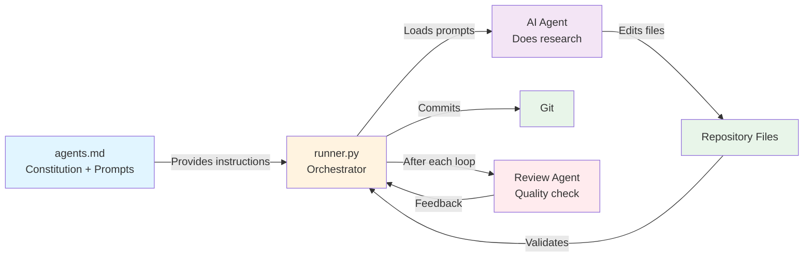

```mermaid
flowchart LR
    A[agents.md<br/>Constitution + Prompts] -->|Provides instructions| R[runner.py<br/>Orchestrator]
    
    R -->|Loads prompts| AI[AI Agent<br/>Does research]
    AI -->|Edits files| Files[Repository Files]
    Files -->|Validates| R
    R -->|Commits| Git[Git]
    
    R -->|After each loop| Review[Review Agent<br/>Quality check]
    Review -->|Feedback| R
    
    style A fill:#e1f5ff
    style R fill:#fff3e0
    style AI fill:#f3e5f5
    style Files fill:#e8f5e9
    style Git fill:#e8f5e9
    style Review fill:#ffebee
```