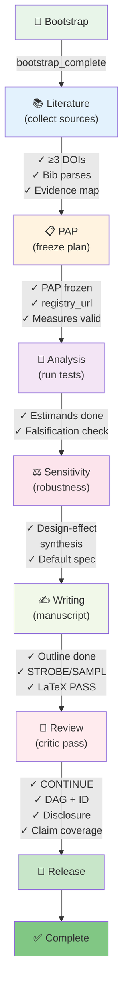

```mermaid
flowchart TD
    Start["🔄 Bootstrap"]
    Lit["📚 Literature<br/>(collect sources)"]
    PAP["📋 PAP<br/>(freeze plan)"]
    Ana["🔬 Analysis<br/>(run tests)"]
    Sens["⚖️ Sensitivity<br/>(robustness)"]
    Writ["✍️ Writing<br/>(manuscript)"]
    Rev["👀 Review<br/>(critic pass)"]
    Rel["🚀 Release"]
    
    Start -->|bootstrap_complete| Lit
    
    Lit -->|"✓ ≥3 DOIs<br/>✓ Bib parses<br/>✓ Evidence map"| PAP
    
    PAP -->|"✓ PAP frozen<br/>✓ registry_url<br/>✓ Measures valid"| Ana
    
    Ana -->|"✓ Estimands done<br/>✓ Falsification check"| Sens
    
    Sens -->|"✓ Design-effect<br/>synthesis<br/>✓ Default spec"| Writ
    
    Writ -->|"✓ Outline done<br/>✓ STROBE/SAMPL<br/>✓ LaTeX PASS"| Rev
    
    Rev -->|"✓ CONTINUE<br/>✓ DAG + ID<br/>✓ Disclosure<br/>✓ Claim coverage"| Rel
    
    Rel --> End["✅ Complete"]
    
    style Start fill:#e8f5e9
    style Lit fill:#e3f2fd
    style PAP fill:#fff3e0
    style Ana fill:#f3e5f5
    style Sens fill:#fce4ec
    style Writ fill:#f1f8e9
    style Rev fill:#ffebee
    style Rel fill:#c8e6c9
    style End fill:#81c784
```